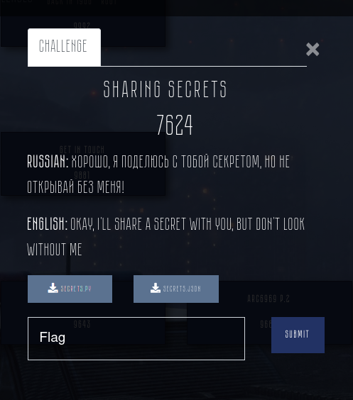

## Challenge info



## Solution

Looking at the code, we can deduce flag's range of length:

```python
pmin = mul(primes[-threshold + 1:])
pmax = mul(primes[:threshold])
assert pmin < flag < pmax
```

We know first 11 primes, from which `pmax` byte length equals `(reduce(mul, primes[:11]).bit_length() + 7) // 8 == 32`. Our list of primes is sorted in an ascending order, so every prime that is present in `pmin` multiplication, should be larger than `primes[10]`. So, we can get a lower estimate on `pmin` length: `(reduce(mul, [primes[10]] * 10).bit_length() + 7) // 8 == 30`

Now, let's look at "shadows". As we can see, each shadow is a result of modulo operation performed on flag by a prime. We know all the divisors for all shadows, so the Chinese Remainder Theorem can be applied here. Passing the values to [one online calculator](https://www.dcode.fr/chinese-remainder), we get `flag == 9428221886877231861101525976023347442473206157716244698345952664867473k + 2178159550098942867962167919858104197099229685013583929450148960962624`. Beautiful. Now we have to brute force all the possible combinations ranging in byte length from 30 to 32:
```python
base = 2178159550098942867962167919858104197099229685013583929450148960962624
addition = 9428221886877231861101525976023347442473206157716244698345952664867473
for i in tqdm(range(0x100 ** 3)):
    try:
        res = long_to_bytes(base + addition * i).decode()
        if "Yauza" == res[:5]:
            print(res)
            break
    except:
        continue
```
And there we have it:


