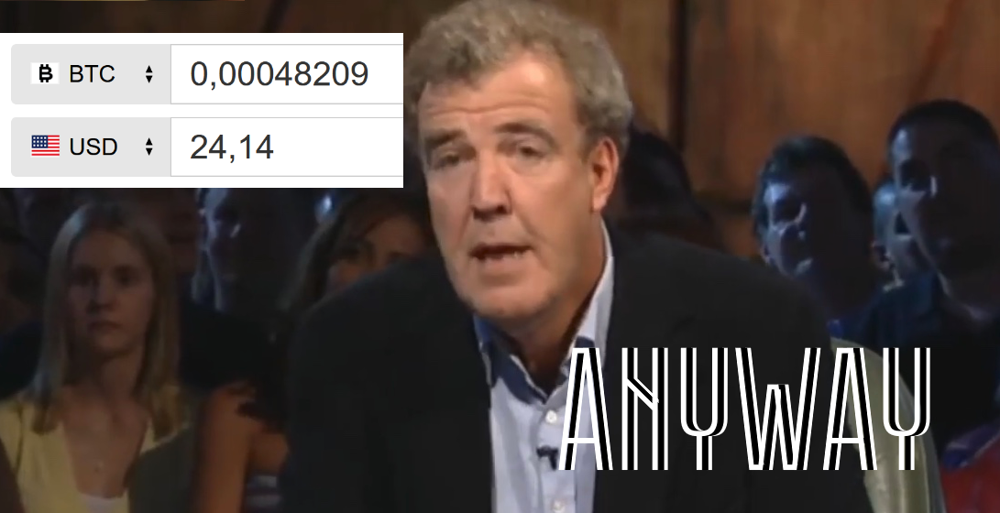
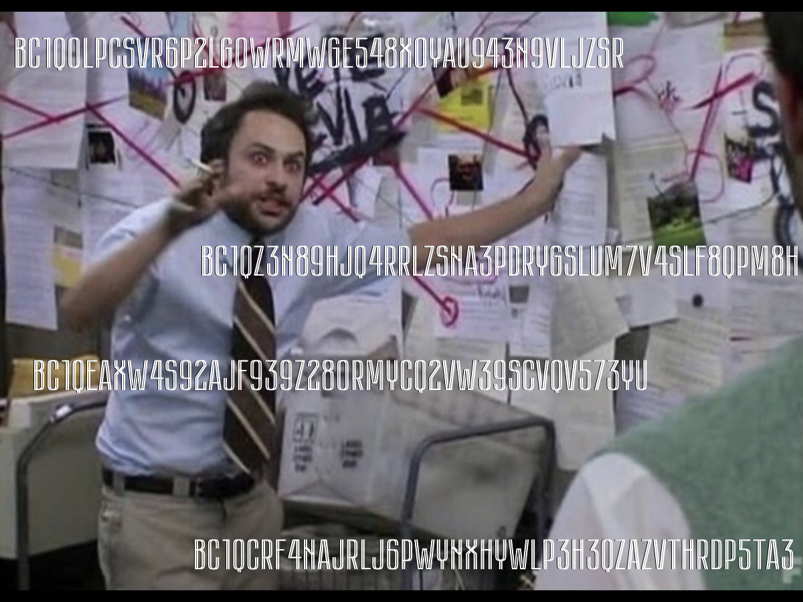
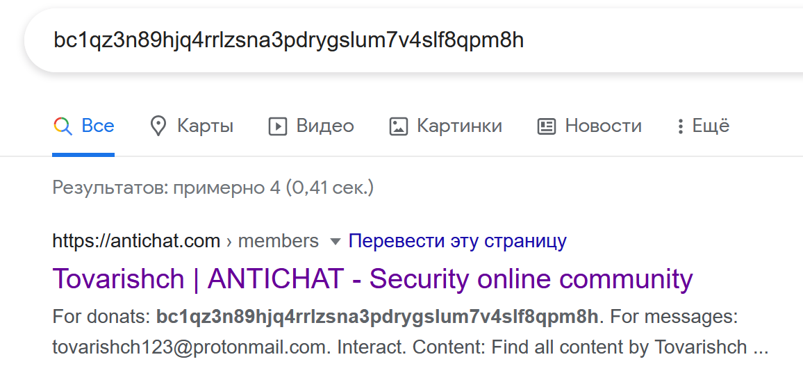
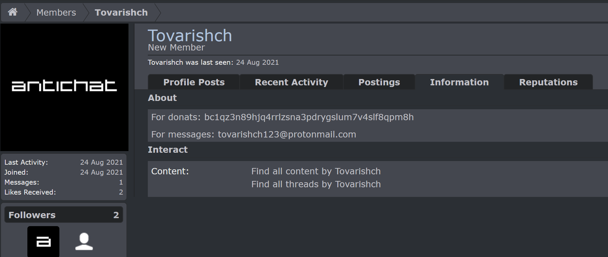
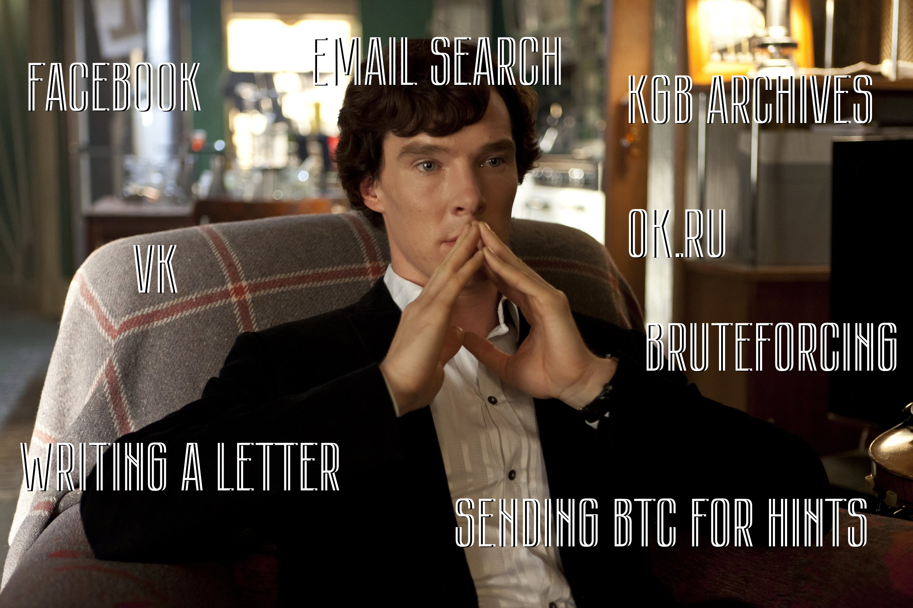
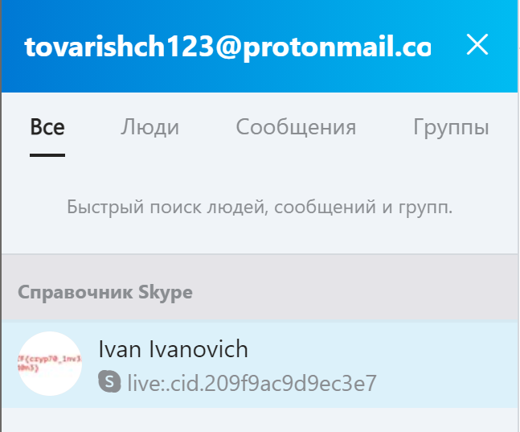
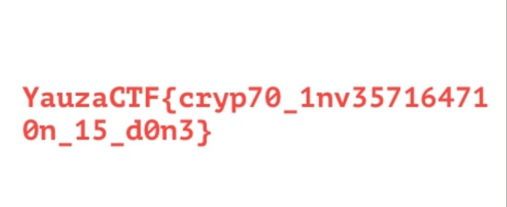

## Challenge info

## Solution

Oh no! Our 0.00048209 BTC was stolen!

So, yeah, our BTC was stored at `bc1qtmyn49urgfu27n30zrghl8499sx42pqrhpm8xt`. Time to search... Actually, [this website](https://www.blockchain.com) provides us with every tool we need.

After surfing the blockchain we localize 2 suspects: 

- `bc1qz3n89hjq4rrlzsna3pdrygslum7v4slf8qpm8h`

- `bc1qeaxw4s92ajf939z280rmycq2vw39scvqv573yu`

The second leads to nothing (we've even tried searching in the Dark Web), but the first... stop right there, criminal scum!

Aha. So, we have one lead... `tovarishch123@protonmail.com`...

The KGB has checked every deep corner of the Internet, from social networks to spam reports... and they found nothing. Let's prove, that they are wrong - and check ourselves...

One old russian meme says: the best file sharing service is [Skype](https://www.youtube.com/watch?v=g5R8eFrEnRI) - and it's fascinating, that it is the correct answer. An account is registered using the Proton Mail, and although it is a bit random to search Skype, it still is possible to guess.

And there you go.

Za vami uzhe viekhali, Tovarishch...
