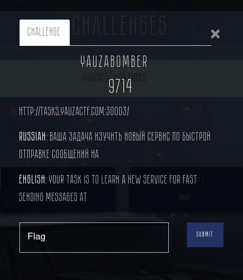
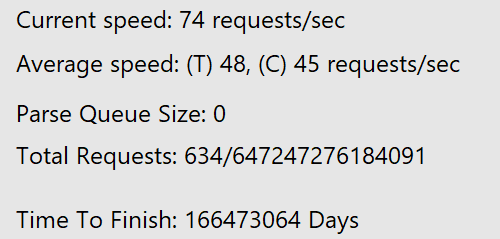
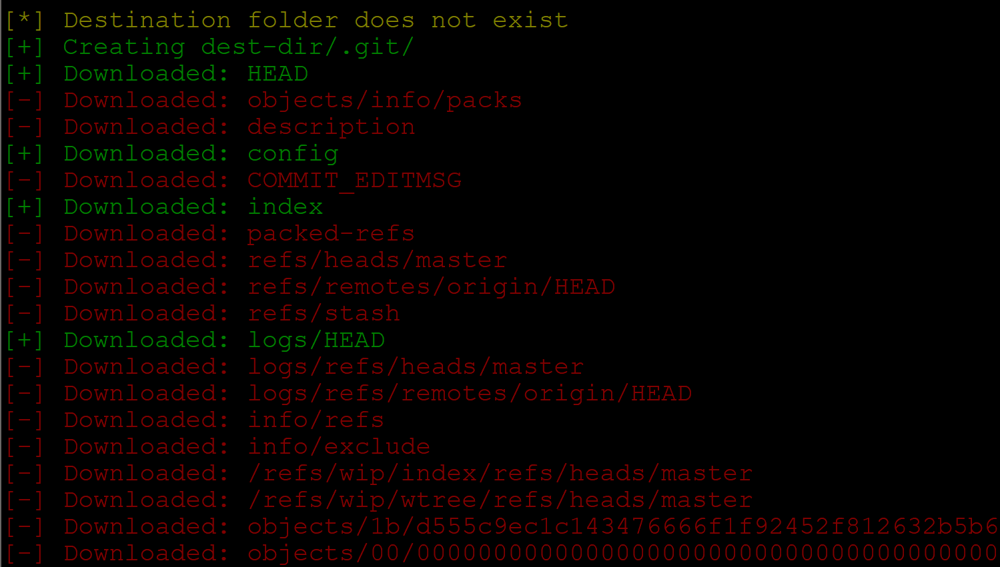
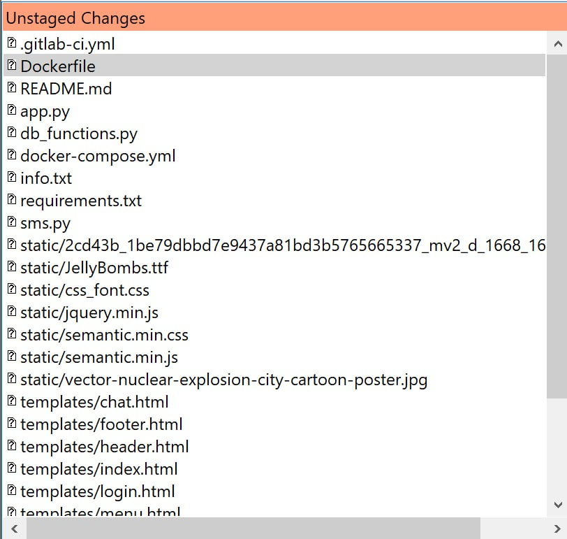
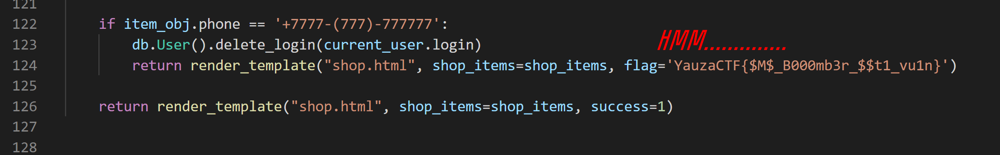

## Challenge info



Sources of the website are located [here](./site-sources).

## Solution

```
Beware of the unintentional solution below!
```


First of all, we decided to scan the website. This can be done with huge variety of tools - like [DirBuster](https://sourceforge.net/projects/dirbuster/), [DIRB](http://dirb.sourceforge.net/) - or if you're lucky, you could test the site using [GitTools Finder](https://github.com/internetwache/GitTools). The key is to find any way and tool to get files from the website.



You may found files from the `./git/` folder, `gitlab-ci.yml` or even `app.py` (with the flag) - it depends on your patience.

We have found `./git/HEAD` file, which led us to using [GitTools](https://github.com/internetwache/GitTools) Dumper to extract information from the git folder. 

Usage is as simple as it sounds:

```
bash gitdumper.sh http://tasks.yauzactf.com:30003/.git/ dest-dir
```



Dumping the `./git` folder gave us the following information (using `git-gui`):



The most interesting file here is, obviously, `app.py`. And just a brief look at the code gives us the neccessary flag:



The flag was an exclamation mark to everything that had led to this point. I released my finger from the keyboard. And then it was over.

### Flag

`YauzaCTF{$M$_B000mb3r_$$t1_vu1n}`