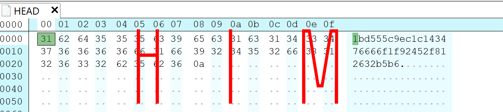
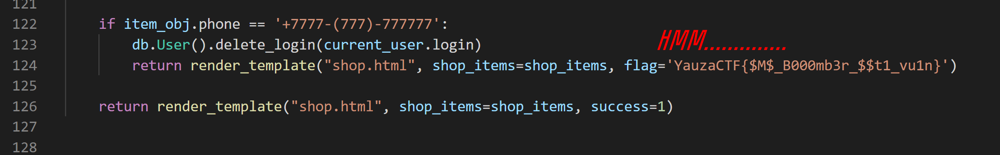

## Challenge info

Sources of the website are located [here](./site-sources).

## Solution

Beware of the unintentional path below!

First of all... we have cool website with c00l design. But we're not interested, we need something more interesting. After several attempts of lame activities with login form, we have found...

him...

What is this? Who knows... btw huge shoutout to [GitTools](https://github.com/internetwache/GitTools) because they allowed us to extract information from the git folder. 

It was really simple and unintentional. Dumping the `./git` folder gave us the following information:

What's the most interesting here? Of course it is `app.py`.

The flag was an exclamation mark to everything that had led to this point. I released my finger from the keyboard. And then it was over.

### Flag

`YauzaCTF{$M$_B000mb3r_$$t1_vu1n}`